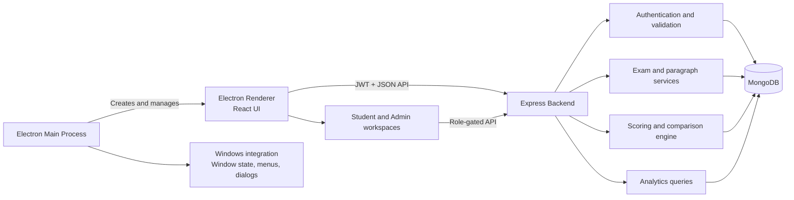

# SAS Academy Typing — Windows Desktop Application

A professional Windows desktop application for competitive-exam typing practice and assessment. SAS Academy provides server-authoritative scoring, automatic exam-mode selection, character-accurate result analysis, performance analytics, and a complete administration workspace in a native desktop window.

Built with Electron, React, Express, MongoDB, and Node.js.

The Electron edition reuses the established React interface and Express API without changing the application's business logic, exam workflows, scoring engine, or administration features.

## Download for Windows

[**Download SAS Academy Typing Portable (.exe)**](./release/SAS-Academy-Typing-Portable-1.0.0.exe)

The portable executable runs directly on Windows 10/11 and does not require installation. For a conventional installer, generate `SAS-Academy-Typing-Setup-1.0.0.exe` with `npm run dist:win:installer` on Windows.

## Desktop Features

- Native Windows application with a dedicated application icon
- Automatic React and Express startup in desktop development mode
- Native minimize, maximize, restore, close, resize, and fullscreen controls
- Remembered window size, position, and maximized state
- Standard desktop keyboard shortcuts for editing, zoom, reload, and fullscreen
- Native file selection and download save dialogs
- Single-instance behavior that restores and focuses the existing window
- Secure renderer isolation with sandboxing and Node.js integration disabled
- NSIS installer configuration and a standalone portable build
- Local static assets, persistent sessions, themes, and typing preferences
- Graceful offline and unreachable-service messages

Desktop notifications and automatic application updates are not currently configured. They should not be advertised or relied upon until a notification workflow and signed update provider are added.

## Contents

- [Highlights](#highlights)
- [Download for Windows](#download-for-windows)
- [Desktop Features](#desktop-features)
- [Exam modes](#exam-modes)
- [Scoring](#scoring)
- [Architecture](#architecture)
- [Technology stack](#technology-stack)
- [Local development](#local-development)
- [Environment variables](#environment-variables)
- [Administrator accounts](#administrator-accounts)
- [Available scripts](#available-scripts)
- [API overview](#api-overview)
- [Windows installation](#windows-installation)
- [Desktop distribution](#desktop-distribution)
- [Testing](#testing)
- [Security](#security)
- [Troubleshooting](#troubleshooting)

## Highlights

### Learner experience

- English and Hindi typing tests
- Automatic TCS/NTA mode selection for actual exams
- Customizable Practice mode with timer, backspace, word highlighting, sound, auto-scroll, font size, and theme controls
- Server-controlled timer and tamper-resistant test sessions
- Refresh recovery for active attempts
- Paste, drop, cut, and unsupported navigation protection
- Automatic submission when time expires
- Responsive light and true-black dark themes
- Results history and performance analytics

### Result analysis

- Gross WPM, Net WPM, accuracy, elapsed time, and keystroke activity
- Full-error and half-error classification
- Character-accurate original-versus-typed comparison
- Red highlighting for full errors and blue highlighting for half errors
- Unicode normalization for English, Hindi, and mixed-language text
- Exam-specific formula explanation on every result

### Administration

- Dashboard statistics
- Exam creation, editing, activation, and deletion
- Searchable paragraph management with language validation
- User search and access control
- Dynamic application name, support email, announcement, and maintenance mode
- Uploaded or catalogue-based exam logos
- History-safe deletion rules that protect saved learner results

## Exam modes

Mode resolution is performed by the server. A client cannot override the mode for an actual exam.

| Exam category | Selected mode | User choice |
| --- | --- | --- |
| `SSC` | TCS | No |
| Any non-SSC actual-exam category | NTA | No |
| `Practice` | TCS, NTA, or Custom | Yes |

This rule is category-based rather than exam-name-based. New SSC exams automatically use TCS mode; new non-SSC exams automatically use NTA mode without additional code changes.

Examples:

- `SSC Stenographer (English)` → TCS
- `SSC CGL DEST` → TCS
- `DSSSB JSA` → NTA
- `RRB NTPC` → NTA
- `Bihar SSC Stenographer` with category `State Exams` → NTA
- `English Typing Practice` → Practice settings

Actual exams launch in one server request without a mode-selection screen. Practice preferences are stored locally and never alter actual-exam settings.

## Scoring

All final metrics are calculated on the server from the reference text, final typed text, authoritative elapsed time, and selected exam.

### Error classification

Full errors carry a weight of `1`:

- Omission
- Addition
- Spelling
- Substitution
- Repetition
- Incomplete word

Half errors carry a weight of `0.5` in every non-steno exam evaluation:

- Spacing
- Capitalization
- Punctuation
- Transposition
- Paragraphic error

Steno/Stenographer exams promote every detected mistake to a full error.

### Formulas

```text
Gross WPM = (Typed characters / 5) / Time in minutes

Non-steno weighted errors = Full errors + (Half errors × 0.5)
Steno weighted errors = Total detected errors

Net WPM = Gross WPM - ((Weighted errors × Penalty) / Time in minutes)

Accuracy = ((Reference characters - Weighted errors) / Reference characters) × 100
```

Accuracy and Net WPM are clamped to valid ranges. The same classified alignment drives persisted counts, formulas, analytics, and Result-page highlighting.

## Architecture



In development, `npm run dev:desktop` starts the Electron application, React development server, and Express backend together. Packaged builds contain the Electron main process and compiled React renderer; they connect to the API selected by `VITE_API_URL`. The current distributable does not embed MongoDB or launch a packaged Express process automatically.

```text
.
├── desktop/                 Electron desktop integration
│   ├── assets/              Windows application icon
│   ├── dev.cjs              Cross-platform Electron development launcher
│   ├── main.cjs             Main process, native window, menus, dialogs, and lifecycle
│   └── preload.cjs          Minimal isolated renderer bridge
├── client/                  React + Vite renderer interface
│   ├── public/              Logos and exam assets
│   └── src/
│       ├── components/      Shared UI components
│       ├── context/         Authentication and site settings
│       ├── layouts/         Student and admin shells
│       ├── pages/           Public, student, result, analytics, and admin pages
│       └── services/        API client and request tracking
├── server/                  Express + MongoDB API
│   ├── scripts/             Seed and administrator utilities
│   ├── tests/               Node test suites
│   └── src/
│       ├── controllers/     Request handlers
│       ├── models/          Mongoose schemas
│       ├── routes/          REST routes
│       ├── utils/           Scoring, JWT, timing, modes, and startup helpers
│       └── validators/      Zod request schemas
├── docs/DESKTOP.md          Desktop development and packaging reference
├── render.yaml              Optional hosted API blueprint
└── package.json             Workspace scripts
```

## Technology stack

| Layer | Technology |
| --- | --- |
| Desktop runtime | Electron 37 |
| Renderer UI | React 19, React Router, Vite |
| UI | CSS, Lucide React |
| Charts | Recharts |
| Backend | Node.js 22, Express 5 |
| Database | MongoDB, Mongoose |
| Validation | Zod |
| Authentication | JWT, bcrypt |
| Email | Nodemailer |
| Security | Helmet, CORS, rate limiting |
| Packaging | electron-builder, NSIS, portable executable |
| Optional API hosting | Render or another Node.js host |

## Local development

### Requirements

- Node.js `22.x`
- npm
- MongoDB running locally or a MongoDB Atlas connection string
- Windows 10/11 for native Windows testing and installer generation

### Installation

```bash
git clone https://github.com/Anshul0563/Typing.git
cd Typing
npm install
npm run install:all
```

Create local environment files:

```bash
cp server/.env.example server/.env
cp client/.env.example client/.env
```

Update at least `MONGODB_URI`, `JWT_SECRET`, `ADMIN_EMAIL`, and `ADMIN_PASSWORD` in `server/.env`, then start the Express API, Vite renderer, and Electron application together:

```bash
npm run dev:desktop
```

| Service | Local URL |
| --- | --- |
| Electron renderer development server | `http://localhost:5173` |
| API | `http://localhost:5000` |
| Health check | `http://localhost:5000/health` |

Electron opens the renderer automatically; the development URL is listed only for diagnostics. The default catalogue is created idempotently during backend startup. Existing admin-edited exams are not overwritten.

## Environment variables

### Server

| Variable | Required in production | Description |
| --- | --- | --- |
| `PORT` | No | API port; defaults to `5000` |
| `NODE_ENV` | Yes | Use `production` in production |
| `MONGODB_URI` | Yes | MongoDB connection string |
| `JWT_SECRET` | Yes | Random secret of at least 32 characters |
| `JWT_EXPIRES_IN` | No | Login-token lifetime; defaults to `7d` |
| `CLIENT_URL` | For hosted clients | Exact allowed client origin; comma-separated exact origins are supported |
| `ADMIN_EMAIL` | Recommended | Startup-managed administrator email |
| `ADMIN_PASSWORD` | Recommended | Startup-managed administrator password |
| `SMTP_HOST` | For email reset | SMTP hostname |
| `SMTP_PORT` | No | SMTP port; defaults to `587` |
| `SMTP_SECURE` | No | `true` for implicit TLS |
| `SMTP_USER` | If required | SMTP username |
| `SMTP_PASSWORD` | If required | SMTP password |
| `MAIL_FROM` | No | Password-reset sender identity |

Hosted production `CLIENT_URL` values must use HTTPS and exact origins. Electron requests loaded from the packaged local application do not require a public desktop origin.

### Client

| Variable | Required | Description |
| --- | --- | --- |
| `VITE_API_URL` | Yes for distribution | API base URL compiled into the desktop renderer, normally ending in `/api` |

Example:

```env
VITE_API_URL=https://api.example.com/api
```

The desktop application stores no database or server secrets. Never commit real credentials or production `.env` files.

## Administrator accounts

Administrators use the same `users` collection as learners with `role: "admin"`. The admin UI and API remain role-gated.

Create or update an administrator:

```bash
cd server
ADMIN_EMAIL="admin@example.com" ADMIN_PASSWORD="StrongPassword123!" npm run admin:upsert
```

For a password that does not appear in shell history:

```bash
cd server
read "ADMIN_EMAIL?Admin email: "
read -s "ADMIN_PASSWORD?Admin password: "
echo
ADMIN_EMAIL="$ADMIN_EMAIL" ADMIN_PASSWORD="$ADMIN_PASSWORD" npm run admin:upsert
```

If the email exists, the command resets its password, assigns the admin role, and reactivates the account. A new email creates an additional administrator.

## Available scripts

Run these commands from the repository root unless noted otherwise.

| Command | Purpose |
| --- | --- |
| `npm run dev:desktop` | Start Electron, the React renderer, and Express API in development mode |
| `npm run dev` | Start the React and Express services without Electron |
| `npm run install:all` | Install client and server dependencies |
| `npm run build` | Build the production React interface without packaging Electron |
| `npm run build:desktop` | Build the production Electron renderer |
| `npm run dist:win` | Generate the Windows installer and portable executable |
| `npm run dist:win:installer` | Generate the NSIS Windows installer |
| `npm run dist:win:portable` | Generate the portable Windows executable |
| `npm test` | Run the server test suite |
| `npm run build --prefix server` | Validate the server entry point |
| `npm run admin:upsert --prefix server` | Create or update an administrator |
| `npm run seed --prefix server` | Rebuild development seed data |

The seed script removes exams outside the default catalogue and updates catalogue definitions. Use it deliberately in development; do not treat it as a routine production migration.

## API overview

The API uses JSON and is mounted under `/api`. Protected routes require:

```http
Authorization: Bearer <token>
```

### Authentication

| Method | Endpoint | Access |
| --- | --- | --- |
| `POST` | `/api/auth/register` | Public |
| `POST` | `/api/auth/login` | Public |
| `POST` | `/api/auth/forgot-password` | Public |
| `POST` | `/api/auth/reset-password` | Public |
| `GET` | `/api/auth/me` | Authenticated |
| `PATCH` | `/api/auth/profile` | Authenticated |
| `PATCH` | `/api/auth/change-password` | Authenticated |

### Exams and paragraphs

| Method | Endpoint | Access |
| --- | --- | --- |
| `GET` | `/api/exams` | Authenticated |
| `POST` | `/api/exams/:id/launch` | Authenticated |
| `GET` | `/api/exams/:id/random-paragraph` | Authenticated |
| `POST` | `/api/exams/:id/start` | Authenticated; Practice continuation |
| `POST` | `/api/exams` | Admin |
| `PUT` | `/api/exams/:id` | Admin |
| `DELETE` | `/api/exams/:id` | Admin |
| `GET/POST` | `/api/paragraphs` | Admin |
| `PUT/DELETE` | `/api/paragraphs/:id` | Admin |

### Results and analytics

| Method | Endpoint | Access |
| --- | --- | --- |
| `POST` | `/api/results` | Authenticated |
| `GET` | `/api/results` | Authenticated owner |
| `GET` | `/api/results/:id` | Owner or admin |
| `GET` | `/api/analytics/summary/:userId` | Owner or admin |
| `GET` | `/api/analytics/trend/:userId` | Owner or admin |
| `GET` | `/api/analytics/exam-stats/:userId` | Owner or admin |
| `GET` | `/api/analytics/mode-comparison/:userId` | Owner or admin |
| `GET` | `/api/analytics/weekly-pattern/:userId` | Owner or admin |
| `GET` | `/api/analytics/hourly-pattern/:userId` | Owner or admin |
| `GET` | `/api/analytics/progress/:userId` | Owner or admin |
| `GET` | `/api/analytics/detailed/:userId` | Owner or admin |

### Administration and settings

| Method | Endpoint | Access |
| --- | --- | --- |
| `GET` | `/api/admin/stats` | Admin |
| `GET` | `/api/admin/users` | Admin |
| `PATCH` | `/api/admin/users/:id/toggle` | Admin |
| `GET/PUT` | `/api/admin/settings` | Admin |
| `GET` | `/api/settings` | Public |

## Windows installation

### Installer

1. Download `SAS-Academy-Typing-Setup-<version>.exe` from the project release.
2. Open the installer and approve the Windows security prompt if the publisher is trusted.
3. Select an installation directory when prompted.
4. Launch **SAS Academy Typing** from the Start menu or desktop shortcut.

The installer is per-user by default and supports normal Windows uninstall behavior. Unsigned local builds may trigger a Microsoft Defender SmartScreen warning; production releases should be code-signed.

### Portable application

Download `SAS-Academy-Typing-Portable-<version>.exe` and run it directly. The portable edition requires no installation and can be moved to another folder or removable drive. Application preferences and authentication storage remain in the Windows user profile.

Both editions require network access to the API configured at build time and to its MongoDB-backed services. Static interface assets load locally.

## Desktop distribution

Windows packages are generated with [electron-builder](https://www.electron.build/). Configuration is stored in the root `package.json`, and output is written to `release/`.

Install dependencies and build both Windows targets:

```bash
npm install
npm run install:all
npm run dist:win
```

Build targets individually:

```bash
# NSIS Windows installer
npm run dist:win:installer

# Standalone portable executable
npm run dist:win:portable
```

Expected artifacts:

```text
release/
├── SAS-Academy-Typing-Setup-1.0.0.exe
├── SAS-Academy-Typing-Portable-1.0.0.exe
└── win-unpacked/
    └── SAS Academy Typing.exe
```

Run packaging on Windows for the most reliable installer generation. Cross-building from Linux requires a complete Wine installation because electron-builder invokes Windows resource and NSIS helpers. Code signing and automatic updates require additional publisher credentials and release-provider configuration; neither is enabled by default.

### Optional hosted API and web client

The desktop renderer currently communicates with a separately running Express API. The included `render.yaml` can deploy that API to Render or serve as a reference for another Node.js host. Set `VITE_API_URL` before packaging so the Windows application targets the correct API.

The original web client remains buildable with `npm run build`. If it is deployed independently, `client/vercel.json` provides the single-page application fallback and the API must allow that web origin through `CLIENT_URL`. Web hosting is optional and is not required to run the Electron renderer.

## Testing

```bash
npm test
npm run build:desktop
npm run build --prefix server
```

The server suite covers routing, CORS, catalogue assets, signed test timing, automatic exam modes, Unicode alignment, formula invariants, error classification, SSC evaluation, and comparison persistence.

## Security

- Passwords are hashed with bcrypt and never returned by the API.
- JWT secrets are validated at production startup.
- Test timing and mode selection are signed into short-lived test tokens.
- Result ownership is enforced server-side.
- Admin routes require an authenticated admin role.
- Zod validates request bodies, query strings, and identifiers.
- CORS uses explicit origins in production.
- Helmet, compression, request-size limits, and rate limiting are enabled.
- Password-reset tokens are random, hashed in storage, single-use, and expire after 15 minutes.
- Production password-reset tokens are delivered by email and are not returned in API responses.
- Electron uses renderer sandboxing, context isolation, and disabled Node.js integration.
- New windows and external navigation are denied inside the renderer and handed to Windows when appropriate.
- Renderer permission requests are denied unless explicitly implemented in the desktop main process.

## Troubleshooting

### The desktop window opens but data does not load

Confirm that the desktop renderer was built with a reachable API URL:

```env
VITE_API_URL=https://api.example.com/api
```

Then rebuild the Windows package. Also check the API health endpoint, firewall, proxy, VPN, and internet connection.

### The first request is slow

A remotely hosted API may be cold-starting or reconnecting to MongoDB. Use an always-on API host when predictable first-request latency is required.

### The API rejects a hosted client origin

This usually affects the optional web client rather than the packaged Electron renderer. Set `CLIENT_URL` to each exact HTTPS web origin, separated by commas, and do not use wildcards.

### Windows displays a SmartScreen warning

Local and development packages are unsigned. Verify the source before continuing. Production distributors should sign the installer and executable with a trusted Windows code-signing certificate.

### The installer does not build on Linux

Install a complete Wine environment or run `npm run dist:win:installer` on Windows. A 64-bit-only Wine runtime may build the portable target but fail while NSIS generates its 32-bit uninstaller helper.

### The application opens more than once or does not regain focus

Only one instance is permitted. If a previous process is stuck, close **SAS Academy Typing** and its Electron processes in Task Manager, then start it again.

### The window size or position is incorrect

Window bounds are stored in Electron's user-data directory. Close the application, remove its `window-state.json`, and restart to restore the default `1280 × 820` window.

### Downloads do not appear

The application asks for a destination through the native Windows save dialog. Confirm the selected folder is writable and that endpoint security software is not blocking the executable.

### No paragraph is available for an exam

Open Admin → Paragraphs and add a paragraph whose language matches the selected exam. Actual exams cannot launch without a matching paragraph.

### Password-reset email fails

Configure `SMTP_HOST`, `SMTP_PORT`, `SMTP_SECURE`, and provider credentials. Verify that `MAIL_FROM` is accepted by the SMTP provider.

### Health endpoint returns `503`

The API process is running, but MongoDB is not connected. Check `MONGODB_URI`, Atlas network access, credentials, and server logs.

---

Developed for focused, accurate, exam-oriented typing practice.
